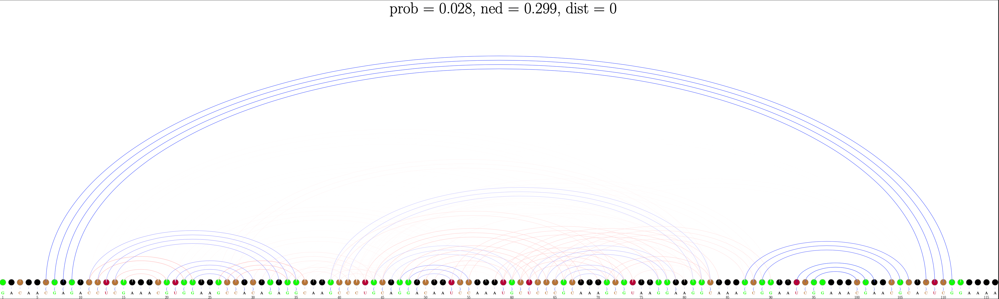
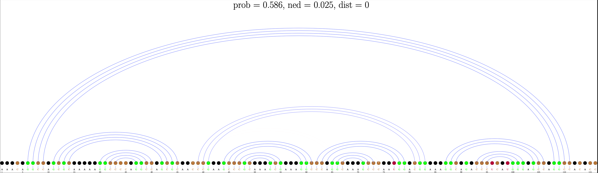

# SAMFEO
RNA Design via Structure-Aware Multi-Frontier Ensemble Optimization

## Dependency
python3 \
ViennaRNA-2.5.1

## Environment Variable
``export VIENNAPATH=/path/to/ViennaRNA/lib/python3.9/site-packages``

## Structured Mutation
<p align="center">

</p>
Diagrams of Structured Mutation. Paired positions are connected by blue dashed lines and each of the rounded rectangles or triangles represents a specific local structure. Diagram a,b,c show structured mutation with paired positions(shaded nucleotides pair). Diagram d,e,f show structured mutation with unpaired positions(shaded nucleotides). When a shaded position is selected for mutation, all the positions within the same local structure would be mutated simultaneously.

## RNA Design Interface
### Online mode (input single structure each time)
``python main.py --online # plus other design options`` 


Example:
```
$ echo "(((((......)))))" | python main.py --online --step 100
args:
Namespace(path='', object='pd', k=10, t=1, step=100, name='', init='cg', repeat=1, start=0, nomfe=False, nosm=False, bp=False, online=True)
(((((......)))))
(((((......)))))
seed_np: 2020
steps: 100, t: 1, k: 10, structured mutation: True, ensemble objective: position_ed_pd_mfe
name_pair: cg
pair_pool: ['CG', 'GC']
0 CGCGCAAAAAAGCGCG:  0.8093,  0.1907
1 CCGCGAAAAAACGCGG:  0.9173,  0.0827
2 CCCGGAAAAAACCGGG:  0.9410,  0.0590
3 GGCCGAAAAAACGGCC:  0.9451,  0.0549
4 CCCCCAAAAAAGGGGG:  0.9384,  0.0616
5 GCGGCAAAAAAGCCGC:  0.9739,  0.0261
6 GCCCCAAAAAAGGGGC:  0.9746,  0.0254
7 GCGCCAAAAAAGGCGC:  0.9739,  0.0261
8 GGGGCAAAAAAGCCCC:  0.9746,  0.0254
9 GCCCGAAAAAACGGGC:  0.9450,  0.0550
iter:    10	 value:  0.0254	 mfe count:    18	 umfe count: 18	 best iter: 0 improve: 0.00e+00
iter:    20	 value:  0.0254	 mfe count:    26	 umfe count: 26	 best iter: 0 improve: 0.00e+00
iter:    30	 value:  0.0241	 mfe count:    35	 umfe count: 35	 best iter: 28 improve: -1.28e-03
iter:    40	 value:  0.0241	 mfe count:    42	 umfe count: 42	 best iter: 28 improve: 0.00e+00
iter:    50	 value:  0.0241	 mfe count:    51	 umfe count: 51	 best iter: 28 improve: 0.00e+00
iter:    60	 value:  0.0241	 mfe count:    59	 umfe count: 59	 best iter: 28 improve: 0.00e+00
iter:    70	 value:  0.0241	 mfe count:    68	 umfe count: 68	 best iter: 28 improve: 0.00e+00
iter:    80	 value:  0.0241	 mfe count:    77	 umfe count: 77	 best iter: 28 improve: 0.00e+00
iter:    90	 value:  0.0241	 mfe count:    85	 umfe count: 85	 best iter: 28 improve: 0.00e+00
iter:   100	 value:  0.0241	 mfe count:    92	 umfe count: 92	 best iter: 28 improve: 0.00e+00
RNA sequence:
GCCCCGAAAAAGGGGC
ensemble objective:  0.02414993696568135
(((((......)))))
(((((......)))))
structure distance: 0
count of mfe solutsion: 92
count of umfe solutions: 92
[RNAStructure('GGGGCAAAAACGCCCC', 0.9745324428444898), RNAStructure('GGGGCAGAACAGCCCC', 0.9745537982728839), RNAStructure('GGGGCAAAGAAGCCCC', 0.9745522394520901), RNAStructure('GGGGCAGAAAAGCCCC', 0.9745541635522057), RNAStructure('GGCCCAAAAAAGGGCC', 0.974676524461917), RNAStructure('GCCCCAAUAAAGGGGC', 0.9745688330920909), RNAStructure('GCCCCAAAAAAGGGGC', 0.9745692982930593), RNAStructure('GCCCCGAAAAAGGGGC', 0.9758500630343186), RNAStructure('GGGGCAAAAAAGCCCC', 0.9745543077208556), RNAStructure('GGAGCGAAGAAGCUCC', 0.9756107700034071)]
 mfe samples: ['GGGCUCAAGAUGGCCC', 'GCCCUUAAAACGGGGC', 'GCCCAAAAAACUGGGC', 'GGCACAGAAAAGUGCC', 'GCCCUAAUAACAGGGC', 'GGGUGCAAGACCACCC', 'GGGGCAAAGAAGCUUC', 'GGGGCAGAACAGCCCC', 'GGUGCAGAAAAGUGCC', 'GCCCCAAAAGAGGGGC']
umfe samples: ['GGGCUCAAGAUGGCCC', 'GCCCUUAAAACGGGGC', 'GCCCAAAAAACUGGGC', 'GGCACAGAAAAGUGCC', 'GCCCUAAUAACAGGGC', 'GGGUGCAAGACCACCC', 'GGGGCAAAGAAGCUUC', 'GGGGCAGAACAGCCCC', 'GGUGCAGAAAAGUGCC', 'GCCCCAAAAGAGGGGC']
kbest: [RNAStructure('GGGGCAAAAACGCCCC', 0.9745324428444898), RNAStructure('GGGGCAGAACAGCCCC', 0.9745537982728839), RNAStructure('GGGGCAAAGAAGCCCC', 0.9745522394520901), RNAStructure('GGGGCAGAAAAGCCCC', 0.9745541635522057), RNAStructure('GGCCCAAAAAAGGGCC', 0.974676524461917), RNAStructure('GCCCCAAUAAAGGGGC', 0.9745688330920909), RNAStructure('GCCCCAAAAAAGGGGC', 0.9745692982930593), RNAStructure('GCCCCGAAAAAGGGGC', 0.9758500630343186), RNAStructure('GGGGCAAAAAAGCCCC', 0.9745543077208556), RNAStructure('GGAGCGAAGAAGCUCC', 0.9756107700034071)]
full results are saved in the file: puzzle_[[[[[......]]]]]_seed_2020.json
```

### Batch mode (input a file in which each line is a structure)
``python main.py --t 1 --k 10 --object pd --path data/eterna/eterna100.txt # plus other design options`` 
### Design options
``--online`` turn on online mode. \
``--t`` set the sampling temprature(T in the paper). The default value is 1. \
``--k`` set the size of frontier(priority queue). The default value is 10. \
``--object`` set objective, the value can be ``pd`` or ``ned``, which stand for probability defect and ensemble defect respectively. The default value is ``pd``. \
``--init`` the sequence initilization method, and the value can be ``cg`` or ``all``, which stand for targeted initilization and random initilization respectively. The default value is ``cg``. \
``--nosm`` if used, the structured mutation will be ablated.  \
``--nomfe`` if used, "mfe as product" will be ablated, i.e., only the sequence with the best score will be used as the designed sequence.

``--step`` set maximum number of iterations. The default value is 5000. \
``--repeat`` set the number of repeated experiments. The default value is 1. (only for batch mode)\
``--start`` set the starting index for naming the output file. The default value is 0. (only for batch mode)
### Batch mode output format
The design results will be output as a csv file with the following columns.

``structure``: the input puzzle (target secondary structure). \
``objective``: the best (lowest) objective value achived during optimization. \
``rna``: the sequence with the best objective during optimization. \
``mfe``: the MFE structure of ``rna``, given by ViennaRNA folding engine. \
``dist``: the distance between ``mfe`` and ``structure``. \
``mfe_list``: a list containing all the MFE solutions found. The order of the list is based on the time when each MFE solution is detected.   \
``umfe_list``: a list containing all the uMFE solutions found. The order of the list is based on the time when each uMFE solution is detected.   \
``k_best``: the priority queue at the final iteration. \
``log``: the objective values at each iteration. \
``time``: the total time used to design the input puzzle ``structure``.

## Solved puzzles
see [data/results/eterna_samfeo.csv](data/results/eterna_samfeo.csv)

### Ensemble metrics


## Base Pair Probability plot
Blue denotes pairs in the target structure and Red denotes predicted pairs not in the target structure. The darkness of the curves indicates pairing probability. The following figs show the design results for the puzzle "Runner" by NEMO and SAMFEO respectively. We can see that there are some red curves in the plot of NEMO, which means those undesired pairs are more likely to apear in the ensemble of sequence designed by NEMO.
### NEMO


### SAMFEO


## 16S Design

