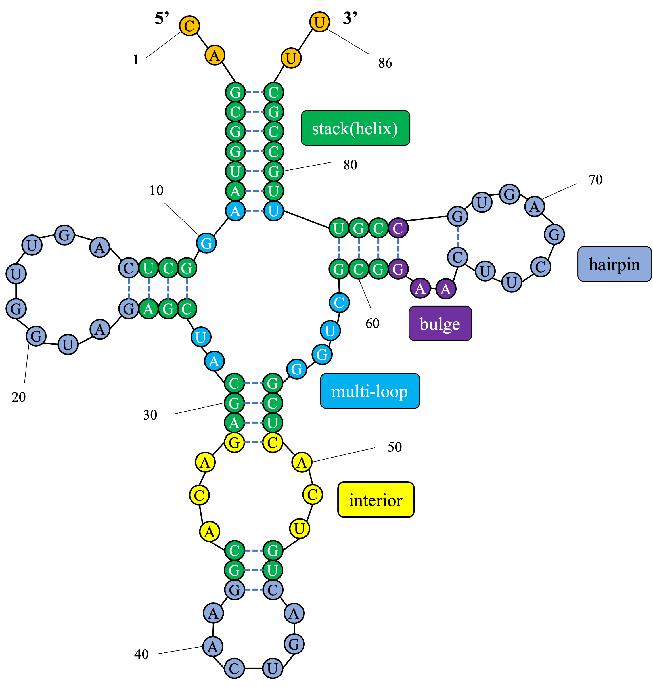
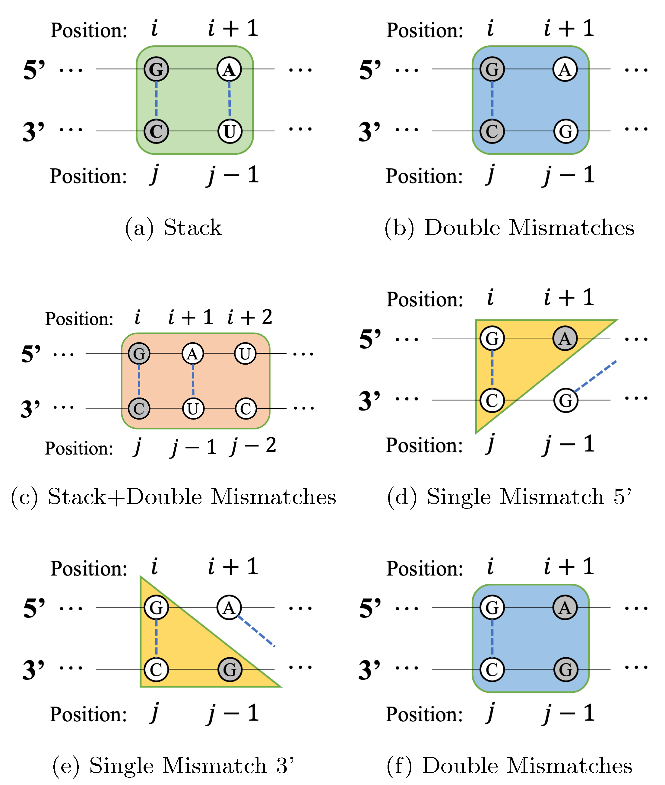
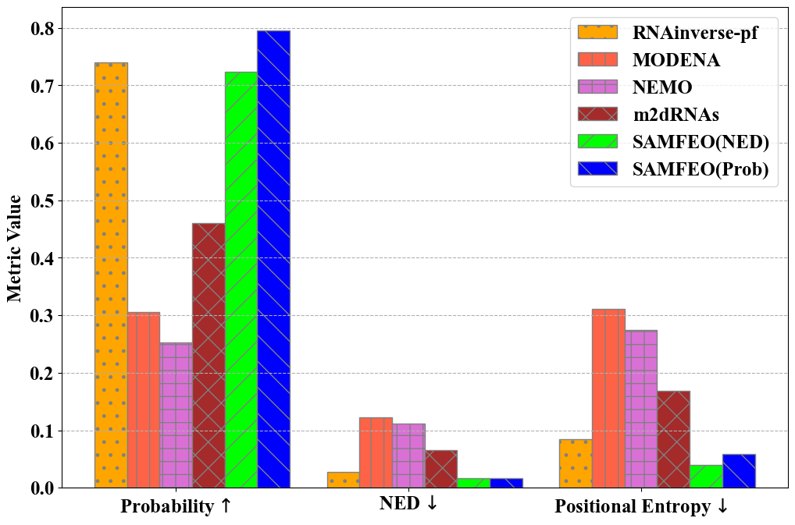
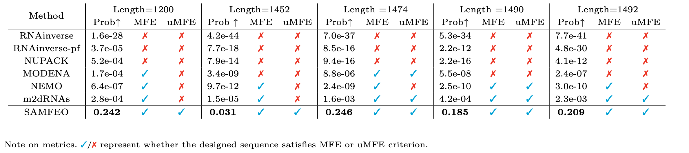

# SAMFEO
RNA Design via Structure-Aware Multi-Frontier Ensemble Optimization

## Dependency
python3 \
ViennaRNA-2.5.1

## Environment Variable
``export VIENNAPATH=/path/to/ViennaRNA/lib/python3.9/site-packages``

## Structured Mutation

Diagrams of Structured Mutation. Paired positions are connected by blue dashed lines and each of the rounded rectangles or triangles represents a specific local structure. Diagram a,b,c show structured mutation with paired positions(shaded nucleotides pair). Diagram d,e,f show structured mutation with unpaired positions(shaded nucleotides). When a shaded position is selected for mutation, all the positions within the same local structure would be mutated simutaneously.

## Eterna100 Design
``python main.py --t 1 --k 10 --object pd --path data/eterna/eterna100.txt`` 

(Design results will be output as a csv file)

## 16S Design

